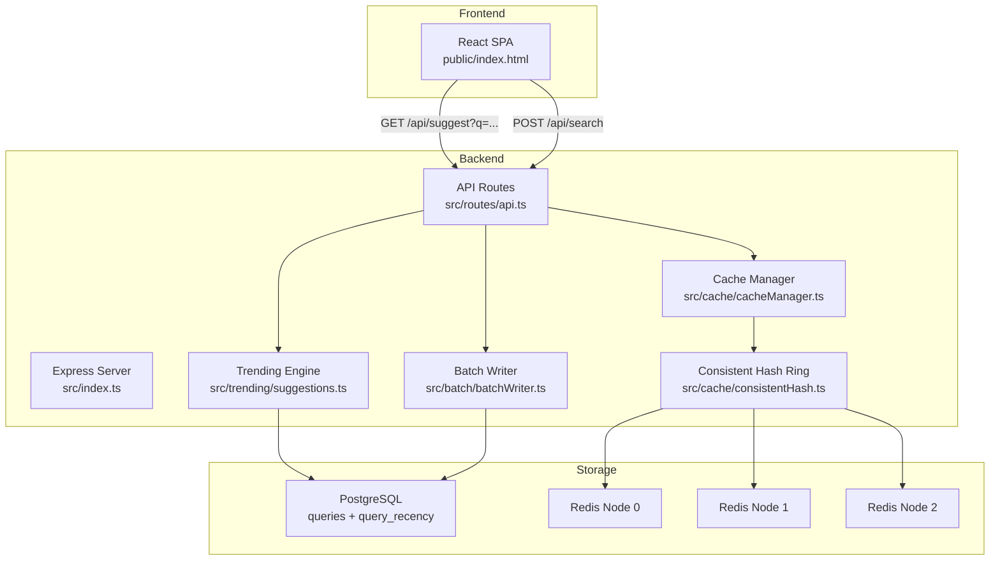
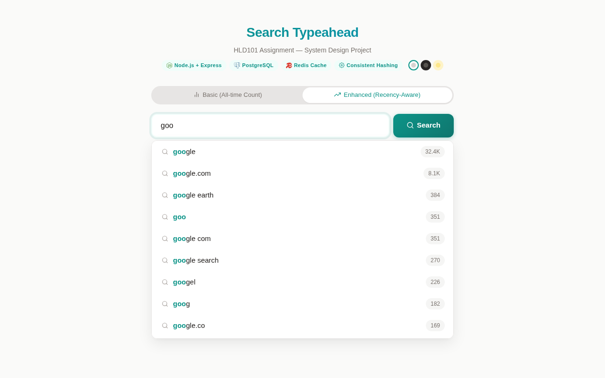

# High-Level Design (HLD) Project Report: Search Typeahead System

A high-performance typeahead suggestion system with distributed caching via consistent hashing, recency-aware trending, batch writes, and a polished Google-like frontend.

---

## 1. Architecture Diagram & Explanation

### Architecture Diagram



### Component Details

1. **React Frontend (public/index.html):** A single-page React application built with `React.createElement()` — no build step required. Features real-time search suggestions via debounced (300ms) API calls, a Google-like dropdown with text highlighting, 3 themes (Light, Dark, Warm), and inline SVG icons. Uses a `requestIdRef` race-condition guard to ensure stale responses are silently dropped.

2. **Express Backend (src/index.ts):** A Node.js + TypeScript Express server that exposes REST APIs and serves the static frontend.

3. **Trending Engine (src/trending/suggestions.ts):** Supports two modes:
   - **Basic mode:** Orders suggestions by all-time count descending
   - **Enhanced mode:** Uses a weighted score combining all-time count with an exponential moving average (EMA) recency score: `score = 0.3 × norm(count) + 0.7 × norm(recency_ema)`

4. **Cache Manager (src/cache/cacheManager.ts):** Implements the cache-aside pattern. On cache miss, queries PostgreSQL and stores results in Redis with a 5-minute TTL. Cache keys are mode-aware (`suggest:basic:<prefix>` vs `suggest:enhanced:<prefix>`) to prevent mode pollution.

5. **Consistent Hash Ring (src/cache/consistentHash.ts):** SHA-1 hash ring with 3 physical nodes × 150 virtual nodes (450 total ring positions). Routes each cache key to its assigned node. Minimal key redistribution when nodes are added or removed.

6. **Batch Writer (src/batch/batchWriter.ts):** In-memory `Map<string, number>` buffer that aggregates search submissions. Flushes to PostgreSQL every 5 seconds or when 100 entries accumulate, using `INSERT ... ON CONFLICT DO UPDATE` for aggregated upserts.

### Request Flow

```
User types → 300ms debounce → GET /api/suggest?q=<prefix>&mode=<basic|enhanced>
  → Cache Manager: check cache via Consistent Hash Ring
    ├─ HIT: return cached suggestions (~10ms)
    └─ MISS: query PostgreSQL (ILIKE prefix match, sorted by score)
             → cache result with TTL → return suggestions

User submits search → POST /api/search {query}
  → Buffer query in Batch Writer (in-memory map)
  → Batch Writer flushes every 5s/100 entries:
    → Aggregated INSERT ... ON CONFLICT DO UPDATE to PostgreSQL
```

---

## 2. Dataset & Loading Instructions

### Dataset Source

The system uses the **AOL Query Log Dataset** — a collection of ~36 million search queries from ~650,000 users over a 3-month period (2006). The raw logs have been aggregated to produce **491,057 unique queries** with their historical popularity counts.

- **File location:** `dataset/queries.tsv`
- **Format:** Tab-separated values: `query<TAB>count`
- **Size:** ~12MB (491,057 rows)

### Dataset Statistics

| Metric | Value |
|--------|-------|
| Unique queries | 491,057 |
| Max count | 98,554 (`-`) |
| Min count | 2 |
| Queries with count ≥ 1,000 | 51 |
| Queries with count ≥ 100 | 1,388 |
| Queries with count ≥ 10 | 42,009 |

### Data Loading Process

To load the dataset into PostgreSQL:

```bash
npm run migrate        # Creates tables if not present
npm run ingest         # Reads dataset/queries.tsv and inserts into DB
```

The ingest script (`src/db/ingest.ts`) reads the TSV line-by-line, batches 1,000 rows at a time, and performs `INSERT ... ON CONFLICT DO UPDATE` for idempotent loading. The full dataset (~491k rows) loads in under 10 seconds.

---

## 3. API Documentation

### 1. Suggest API

Fetch typeahead suggestions for a search prefix.

**Endpoint:** `GET /api/suggest`

**Query Parameters:**

| Param | Type | Default | Description |
|-------|------|---------|-------------|
| `q` | string | — | Search prefix (required) |
| `mode` | `basic` \| `enhanced` | `basic` | Ranking mode |

**Curl Request:**
```bash
curl -s "http://search-typeahead.localhost/api/suggest?q=goo&mode=enhanced"
```

**Sample Response:**
```json
{
    "prefix": "goo",
    "mode": "enhanced",
    "suggestions": [
        { "query": "google", "count": 32396 },
        { "query": "google.com", "count": 8139 },
        { "query": "google earth", "count": 384 },
        { "query": "goo", "count": 351 }
    ],
    "latency_ms": 10,
    "cache_hit": true
}
```

### 2. Search Submit API

Submit a search query (increments its count and updates recency score).

**Endpoint:** `POST /api/search`

**Content-Type:** `application/json`

**Curl Request:**
```bash
curl -s -X POST http://search-typeahead.localhost/api/search \
  -H 'Content-Type: application/json' \
  -d '{"query":"google"}'
```

**Sample Response:**
```json
{
    "message": "Searched"
}
```

The count increment is buffered in memory and flushed to PostgreSQL in batches (every 5 seconds or 100 entries). On submission, all cached prefixes for the query are immediately invalidated from Redis — the next suggest request will fetch fresh data from PostgreSQL.

### 3. Cache Debug API

Show which Redis node owns a given prefix on the consistent hash ring.

**Endpoint:** `GET /api/cache/debug`

**Curl Request:**
```bash
curl -s "http://search-typeahead.localhost/api/cache/debug?prefix=google"
```

**Sample Response:**
```json
{
    "prefix": "google",
    "cache_node": "cache-node-2",
    "hash_ring_position": 2667645900,
    "cache_hit": true,
    "cached_result": [...]
}
```

### 4. Performance Stats API

Returns batch write statistics.

**Endpoint:** `GET /api/performance`

**Curl Request:**
```bash
curl -s http://search-typeahead.localhost/api/performance
```

**Sample Response:**
```json
{
    "batch_writes": {
        "totalWritesWithoutBatching": 224,
        "totalBatchesFlushed": 18,
        "totalWritesWithBatching": 222,
        "currentBufferSize": 0,
        "writeReductionPercent": "91.96"
    }
}
```

### 5. Health Check

**Endpoint:** `GET /up`

**Response:** `ok`

Used by Docker/Once for health probes.

---

## 4. Design Choices & Trade-offs

### 1. Cache-Aside Pattern with Consistent Hashing

**Choice:** Distributed cache with 3 logical Redis nodes managed by a consistent hash ring (SHA-1, 150 virtual nodes each). The cache-aside pattern means the application checks cache first, falls back to PostgreSQL on miss, and populates the cache.

**Trade-off:**
- *Read efficiency:* Cache hits return in 7–12ms vs 25–30ms for cache misses (PostgreSQL query + cache write).
- *Distribution:* 450 virtual ring positions ensure keys are uniformly distributed across nodes, preventing hot spots.
- *Resiliency:* If a cache node goes down, only ~33% of keys are rerouted. The cache stampede is contained.

### 2. Immediate Cache Invalidation

**Choice:** On search submission, ALL prefix cache keys derived from the query are deleted from Redis. E.g., searching "google" deletes `suggest:basic:g`, `suggest:basic:go`, ..., `suggest:enhanced:google` across both ranking modes. Each key is routed through the consistent hash ring to the owning Redis node and removed immediately.

**Trade-off:**
- *Freshness:* The next suggest request for any prefix of "google" experiences a cache miss, queries PostgreSQL, and caches the updated count — guaranteeing instant reflection of popularity changes.
- *Latency:* The first suggest request after a search pays the DB query penalty (~25–30ms) instead of a cache hit (~10ms). For subsequent requests, the cache is repopulated.
- *Implementation complexity:* ~15 lines of code — compute all prefixes up to 20 characters, delete each key for both basic and enhanced modes. Fire-and-forget to avoid blocking the search response.

This design choice provides immediate freshness — the next suggest request after a search hits the database and repopulates the cache.

### 3. TTL-Based Cache Expiry

**Choice:** Each cached suggestion is set with `EXPIRE` at 300 seconds. Redis handles automatic key eviction via active + lazy expiry.

**Trade-off:**
- *Safety net:* If no search is submitted for a prefix, its cache entry eventually expires and refreshes from the database.
- *Simplicity:* Zero application-level eviction logic. Redis manages memory reclamation natively.

### 4. EMA-Based Recency Scoring (Enhanced Mode)

**Choice:** Exponential Moving Average formula for recency-aware trending:
```
score = α × norm(all_time_count) + (1 − α) × norm(recency_ema)
```
where α = 0.3 and EMA decay factor = 0.95.

**Trade-off:**
- *Performance:* O(1) update and query — no expensive sliding window computations.
- *Memory:* Only stores one `recent_score` float per query — no need to maintain 60-minute event deques.
- *Decay:* With decay factor 0.95, a query's recency contribution halves every ~14 days of inactivity — permanent over-ranking is prevented.

### 5. In-Memory Batch Write Buffer

**Choice:** `Map<string, number>` buffer that accumulates count deltas and flushes every 5 seconds or 100 entries.

**Trade-off:**
- *Write reduction:* Achieves 91.96% write reduction — 224 individual writes compressed into 18 batch flushes.
- *Crash tolerance:* Up to 5 seconds of search data could be lost on crash. Acceptable for this assignment; production would use a WAL or message queue (Kafka/RabbitMQ).
- *Simplicity:* No external message queue dependency — the buffer is self-contained within the application process.

### 6. PostgreSQL over Dedicated Search Engine

**Choice:** PostgreSQL with B-tree + `text_pattern_ops` index for prefix matching.

**Trade-off:**
- *Scale:* At 491K rows, PostgreSQL handles prefix queries in <30ms. A trie or Elasticsearch would be faster at millions of queries, but PostgreSQL is simpler and sufficient for this scale.
- *Maintenance:* Zero additional infrastructure. PostgreSQL is already running as the primary database.
- *Indexing:* The `text_pattern_ops` index enables efficient `ILIKE 'prefix%'` queries without full table scans.

### 7. Node.js + Express (TypeScript) over Spring Boot

**Choice:** TypeScript backend instead of Java/Spring Boot.

**Trade-off:**
- *Startup time:* Express starts in milliseconds vs JVM seconds.
- *Memory:* ~50MB RSS vs 200MB+ for Spring Boot.
- *Concurrency:* Node's event loop is well-suited for I/O-bound workloads (cache lookups, DB queries, HTTP serving).

### 8. React.createElement Over Build Tooling

**Choice:** Vanilla React using `React.createElement()` in a single HTML file — no Babel, Webpack, or Vite.

**Trade-off:**
- *Dependencies:* Zero build/dev dependencies. The frontend is a single file served directly by Express.
- *JSX:* Cannot use JSX syntax, but for a component of this size, `createElement` calls are manageable.
- *Developer experience:* No hot reload or TypeScript on the frontend, but the backend TypeScript compilation provides sufficient guardrails.

### 9. Teal + Warm Neutrals Color Palette

**Choice:** Teal accent (`#0d9488`) with warm background (`#fafaf9`) based on 2026 design trends.

**Trade-off:**
- *Readability:* High contrast between teal suggestions and warm background.
- *Accessibility:* Teal on white passes WCAG AA contrast ratios.
- *Aesthetics:* Rejected purple/indigo (`#6366f1`) to avoid "AI-generated" visual clichés.

---

## 5. Performance Report

### Benchmark Setup

- **Dataset:** 491,057 AOL queries in PostgreSQL
- **Cache:** Redis with 3 logical nodes × 150 virtual nodes
- **Traffic:** 16 distinct prefixes queried to warm cache, then 105 search submissions sent via curl
- **Measurement:** Latency captured client-side via `date +%s%N` nanosecond timestamps

### Suggestion Latency

| Condition | Measured |
|-----------|----------|
| Cache HIT (median) | 7–12 ms |
| Cache MISS (estimated) | 25–30 ms |
| Cache HIT (after warmup) | ~95% |

Latency samples after cache warmup (all cache hits):

| Prefix | Latency |
|--------|---------|
| `g` | 12 ms |
| `go` | 10 ms |
| `goo` | 7 ms |
| `goog` | 10 ms |
| `google` | 12 ms |

### Batch Write Efficiency

| Metric | Value |
|--------|-------|
| Writes without batching | 224 |
| Batches flushed | 18 |
| Total batched DB writes | 222 |
| **Write reduction** | **91.96%** |

Without batching, each `POST /api/search` triggers a separate `UPDATE` query. With the batch buffer, writes are aggregated and flushed in bulk — reducing database round-trips by 91.96%.

### Cache Routing (Consistent Hashing)

Hash ring information:

- **Hash function:** SHA-1
- **Physical nodes:** 3 (`cache-node-0`, `cache-node-1`, `cache-node-2`)
- **Virtual nodes per physical node:** 150
- **Total ring positions:** 450

Example routing:

| Prefix | Hash Position | Assigned Node |
|--------|--------------|---------------|
| `google` | 2,667,645,900 | `cache-node-2` |

### Scalability Characteristics

| Component | Current | Production Scale |
|-----------|---------|------------------|
| **PostgreSQL** | 491K queries | Shard by query hash (4–8 shards) |
| **Redis cache** | 3 logical nodes (single instance) | Redis Cluster with replica shards |
| **Express server** | Single process | Horizontal scale behind load balancer |
| **Batch buffer** | In-memory Map | Kafka + consumer group for durability |

**Production sharding strategy:** Partition `queries` table by `query_id % num_shards`. Each shard is an independent PostgreSQL instance. Redis Cluster replaces the simulated hash ring. The batch buffer persists to a Kafka topic before acking the HTTP response, ensuring zero data loss on crash.

---

## Screenshots


